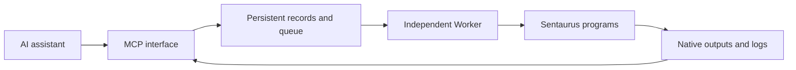

# Sentaurus MCP | Connect AI assistants to TCAD

[中文](README.md) | **English**

**Prepare inputs, submit simulations, inspect status, and read logs through an MCP-compatible AI assistant.**

For device researchers who already use Sentaurus. This standalone tool connects an assistant to batch experiments without requiring a private research dashboard.

> **Version 0.1 — prototype.** Synthetic tests have passed; real Sentaurus execution has not been validated. A working Sentaurus installation and license are required. No private device designs, credentials, or experimental data are included.

[Features](#features) · [Quick start](#quick-start) · [Example requests](#example-requests) · [How it works](#how-it-works) · [FAQ](#faq) · [Validation](#validation)

## Features

| Task | Current support |
| --- | --- |
| Prepare an experiment | Save text inputs, stage configuration, and input fingerprints |
| Submit SDE, SDevice, or SVisual | Batch launch interface implemented; verify actual commands on your installation |
| Queue multiple experiments | Configurable maximum concurrent experiments; default 1 |
| Inspect current and historical runs | Persistent state, stage, process IDs, and timing |
| Read logs | Incremental reads with bounded responses |
| Find output files | File listing; no TDR parsing or automatic plotting |
| Continue after the AI client exits | Supported while the independently started Worker remains operational |
| Create or append native Workbench experiments | Not implemented; current directories are batch folders |
| Validate physics, extract metrics, optimize parameters | Not implemented |
| Fill available CPU, memory, or license capacity | Not implemented; only concurrent experiment count is limited |
| ZIP export, cancellation, crash recovery | Not implemented |

## Quick start

This example installs the service **on a Linux simulation server**.

### 1. Prerequisites

- Python 3.10 or later.
- A working Sentaurus installation and valid license.
- A writable data directory.
- An MCP client supporting standard input/output transport.

First verify that your account can run your simulation scripts directly. This package does not install Sentaurus or supply licenses.

### 2. Install

```bash
git clone https://github.com/HanKin666/sentaurus-mcp.git
cd sentaurus-mcp
python3 -m venv .venv
source .venv/bin/activate
python -m pip install -e .
```

A private repository requires access from the account used to clone it.

### 3. Configure executables and storage

```bash
cp examples/config.example.json config.json
```

Replace every placeholder below with your own **absolute path**:

```json
{
  "root": "/absolute/path/to/experiments",
  "max_parallel": 1,
  "tools": {
    "sde": ["/absolute/path/to/sde", "-e", "-l", "{input}"],
    "sdevice": ["/absolute/path/to/sdevice", "{input}"],
    "svisual": ["/absolute/path/to/svisual", "-b", "{input}"]
  }
}
```

| Setting | Meaning |
| --- | --- |
| `root` | Storage for inputs, results, logs, and the experiment database |
| `max_parallel` | Concurrent experiments, **not CPU threads per experiment** |
| `tools` | Allowed executables and arguments; check your installed Sentaurus release |
| `{input}` | Replaced with the stage input filename |

Keep the required license and runtime environment configured on the server. Do not commit private configuration or credentials.

### 4. Start the Worker independently

In a separate terminal with the environment activated:

```bash
export SENTAURUS_MCP_CONFIG="/absolute/path/to/sentaurus-mcp/config.json"
sentaurus-worker
```

Keep this terminal open, or manage the Worker with a server service manager.

**The Worker must run independently of the AI client.** It manages the queue and launches simulations. Do not start it as a child of the MCP client.

### 5. Connect the AI client

Generic JSON example for a client running **on the same machine** as the MCP service. The configuration location and outer format depend on your client:

```json
{
  "mcpServers": {
    "sentaurus": {
      "command": "/absolute/path/to/sentaurus-mcp/.venv/bin/sentaurus-mcp",
      "env": {
        "SENTAURUS_MCP_CONFIG": "/absolute/path/to/sentaurus-mcp/config.json",
        "SENTAURUS_ENABLE_ACTIONS": "1"
      }
    }
  }
}
```

- Set `SENTAURUS_ENABLE_ACTIONS=1` to permit preparation and submission. Omit it or use `0` for read-only access.
- The MCP service and Worker must use the same configuration.
- For a Windows client and Linux server, configure an SSH STDIO connection so the MCP executable runs on the server. A server path cannot be used as a Windows local executable. No automatic remote setup wizard is provided.
- A Windows local installation typically uses `.venv/Scripts/sentaurus-mcp.exe`; this does not imply Sentaurus is available there.

A successful connection should expose the six tools listed below. Start the Worker before submitting experiments.

## Example requests

After providing complete, reviewed input scripts, ask your assistant:

> Create an experiment using my SDevice input. Save it and report its ID, but do not submit yet.

> Submit that experiment, then report its current stage and elapsed time.

> Read the new log output. Separate reported errors from possible explanations, and do not restart the experiment automatically.

> List the output files and identify logs and native simulation results.

These are usage examples, not completed simulation results. The tool does not automatically supply physical models or certify results.

<details>
<summary>Tool reference</summary>

| Tool | Purpose |
| --- | --- |
| `create_experiment` | Prepare text inputs and stages without running |
| `submit_experiment` | Queue a prepared run; duplicates do not restart it |
| `list_experiments` | Paginated persistent history |
| `get_experiment` | Status, manifest, process IDs, and timing |
| `read_log` | Bounded log reads using byte offsets |
| `list_artifacts` | File index without embedding large TDR data |

`files` maps filenames to text. Each entry in `stages` contains `tool` and `input_file`. Tools must be configured and input files supplied. Combined text input is limited to 2 MB per experiment.

The `sentaurus://capabilities` resource describes the implemented scope.

</details>

## How it works



The MCP interface handles assistant requests; the Worker runs experiments. A simulation does not need to keep a conversation request open.

Example storage layout; output names depend on your scripts:

```text
data/
├── experiments.sqlite3
└── project/
    └── run_id/
        ├── input scripts
        ├── manifest.json
        ├── runner.log
        ├── stage-0.log
        ├── state.json
        └── simulation outputs
```

The manifest records input fingerprints and stages. The database contains live state; the runner writes final `state.json` during its normal finalization path. Multiple experiments can share a project directory. These folders are **not generated native Workbench projects**.

## FAQ

### Does completed mean physically correct?

No. `completed` means all stage processes exited successfully. Numerical convergence, physical credibility, and metric acceptance still require review. Validation defaults to unreviewed.

### Does a conversation timeout stop the solver?

There is no fixed wall-clock solver timeout. With an independently running Worker, normal MCP client shutdown does not stop a simulation. Query the existing run after a disconnect before creating another one.

Host shutdown, process crashes, and external scheduler limits can still interrupt tasks. Automatic recovery is not implemented.

### Why is submission rejected?

Check the Worker heartbeat, shared configuration, write-action setting, and input fingerprints. Inputs modified after preparation are rejected; create a new experiment record for revised inputs.

### Why does a run still say running?

Inspect real processes and logs. An abnormal exit may leave stale state. Automatic reconciliation is not implemented; do not clear states merely to bypass concurrency limits.

### Can it plot TDR data?

It currently lists files only. TDR parsing, native slices, metric extraction, and ZIP export are future work.

### Which timing and hardware data are recorded?

Stage and overall runtime, process IDs, platform identifier, and host-visible CPU count. **Host CPU count is not the number of cores used by the experiment.** Peak process memory, full hardware inventory, and end-to-end optimization timing are not fully collected.

### Is this a sandbox?

No. Submitted scripts run with the server account's authority. Use trusted clients and enforce account/resource limits through the operating system or scheduler.

## Validation

```bash
python -m pip install -e '.[test]'
python -m pytest -q
```

Recorded local validation: Windows, Python 3.12, **5 tests passed**, covering real MCP protocol interaction, continued execution after client exit, duplicate submission, input validation, and concurrency limits.

Tests use synthetic Python tasks, not real Sentaurus simulations. A Linux CI workflow is included; check the repository Actions page for its status. See [validation details](VALIDATION.md).

## Future work

Not currently implemented:

- Real Sentaurus integration validation across installed releases.
- Native Workbench project creation and experiment append.
- CPU, memory, and license admission control.
- Cancellation, stale-state reconciliation, and recovery.
- TDR parsing, metrics, native figures, and output packaging.

## Development background

This project grew out of using Codex to assist Sentaurus TCAD research. The development workflow combined viewing the remote native Sentaurus interface through VNC Viewer with script execution, log analysis, and result checks. Reusable experiment-management steps were then organized into an MCP interface.

| Component | Role in the workflow |
| --- | --- |
| Codex | Assist with writing and revising scripts, organizing experiments, analyzing logs, and developing tools |
| VNC Viewer | View remote Sentaurus interfaces and support manual checks of structures and run status |
| Sentaurus | Perform the actual structure, mesh, and device simulations |
| This MCP and its independent Worker | Expose preparation, submission, status, and log tools to AI clients and launch batch tasks |

The current release starts simulations through an independent server-side Worker. It does not require Codex to operate VNC Viewer, and other AI clients supporting the applicable MCP connection can connect. Automated VNC interaction, interactive SDE modeling, and native screenshot capture are not features of the current release.

The private research dashboard, server configuration, and device experiment data used during development are not distributed with this repository. This background does not imply that the current MCP has passed real Sentaurus end-to-end validation; see the [validation record](VALIDATION.md) for the tested scope.

## References and licensing

Documentation organization draws on [Playwright MCP](https://github.com/microsoft/playwright-mcp) and the [MCP Python SDK](https://github.com/modelcontextprotocol/python-sdk).

Architecture research references: [Ansys Mechanical MCP](https://github.com/ansys/pymechanical-mcp), [Ansys AEDT MCP](https://github.com/ansys/pyaedt-mcp), and [OpenFOAM MCP](https://github.com/SciMate-AI/openfoam-mcp). Implementation is independent; no source code was copied.

Uses the official MCP Python SDK with `>=1.12,<2`. An open-source license has not yet been selected. This unofficial project is not endorsed by Synopsys and includes no commercial software, manuals, or licenses.
