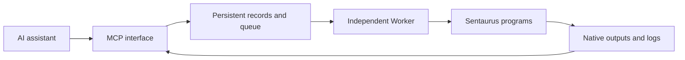

# Sentaurus MCP | Connect AI assistants to TCAD

[中文](README.md) | **English**

**Prepare inputs, submit simulations, inspect status, and read logs through an MCP-compatible AI assistant.**

For semiconductor device researchers who already use Sentaurus. This standalone tool connects an assistant to batch experiments without requiring a private research dashboard.

> **Version 0.1 — prototype.** Synthetic tests have passed; real Sentaurus execution has not been validated. A working Sentaurus installation and license are required. No private device designs, credentials, or experimental data are included.

[Features](#features) · [Quick start](#quick-start) · [Example requests](#example-requests) · [How it works](#how-it-works) · [FAQ](#faq) · [Validation](#validation)

## Quick start

### Only have a port and password? Send this to your AI assistant

Use an assistant with **local file access, command execution and MCP configuration capabilities**. A plain web chat without these tools can only guide you.

```text
Help me install and connect this Sentaurus MCP:
https://github.com/HanKin666/sentaurus-mcp

I am a beginner. I only know a port and password and am unsure whether
the connection is VNC or SSH. Use the latest main-branch documentation
and setup wizard. Check the local installation first.
Ask only for the next missing piece of information.

Start by asking for the server address and the application I normally use.
Do not treat a port as an address or guess an SSH port.
Let me enter passwords locally with hidden input, never in this chat.

If existing settings can help, ask me to identify the specific file or
connection entry. Extract only address, port and username, not passwords
or private-key contents.
Report local installation, server connection, Worker status and
Sentaurus validation separately. Saved settings or a visible desktop
do not mean simulation is ready.
Before submitting a real experiment, explain its purpose and resources.
```

Use the latest `main` code. The early `v0.1.0-alpha.1` archive lacks the subsequently added diagnostics and wizard. This prompt guides a capable assistant; it does not guarantee automatic deployment by every LLM.

### What the assistant should ask

| Question | What you provide |
| --- | --- |
| Server address? | Administrator-provided IP/hostname, or the address of an existing connection with secrets hidden |
| Which connection application? | VNC Viewer, terminal or SSH client; “unknown” is fine |
| Port or display number? | Your known value; `:1` or `:01` may be VNC display notation, not a TCP port |
| May I check this endpoint's greeting? | Optional consent for one endpoint only, without scanning |
| Username? | Linux username for SSH; some VNC connections need no username |
| Save connection settings locally? | Choose a local `.txt` path; optional passwords go to the system credential store |
| Is SSH access available? | Continue SSH setup if available; otherwise follow the VNC-only guidance |

**A port and password alone do not identify a server.** An address is also needed. The assistant should help find missing details rather than demand a complete technical configuration at once.

### VNC-only users

The wizard can save your settings, and VNC can still display Sentaurus. **This MCP does not automate VNC or deploy a server agent through VNC.** A VNC password alone cannot connect the remote Worker.

Ask your administrator:

> I already have VNC access and want to use Sentaurus MCP. Is SSH permitted? Please provide the address, SSH port, Linux username and approved authentication method. If SSH is unavailable, can a Python MCP service and client run locally on the server?

### Letting the assistant read existing settings

Name the specific file or connection entry and authorize extraction of address, port and username only. Do not authorize reading passwords/private keys or scanning unrelated directories.

This requires the assistant's own file-access tools. The wizard's `--load` only reads its own profile format; it does **not** automatically import every VNC/SSH client format.

Experienced users and deployment assistants can continue with [manual installation](#manual-installation) and [remote connection](#connecting-to-a-remote-server).

## Features

| Task | Current support |
| --- | --- |
| Prepare an experiment | Save text inputs, stage configuration, and input fingerprints |
| Submit SDE, SDevice, or SVisual | Batch launch interface implemented; verify actual commands on your installation |
| Queue multiple experiments | Configurable maximum concurrent experiments; default 1 |
| Inspect current and historical runs | Persistent state, stage, process IDs, and timing |
| Read logs | Incremental reads with bounded responses |
| Find output files | File listing; no TDR parsing or automatic plotting |
| Continue after the AI client exits | Supported while the independently started Worker remains operational |
| Create or append native Workbench experiments | Not implemented; current directories are batch folders |
| Validate physics, extract metrics, optimize parameters | Not implemented |
| Fill available CPU, memory, or license capacity | Not implemented; only concurrent experiment count is limited |
| ZIP export, cancellation, crash recovery | Not implemented |

## Manual installation

This example installs the service **on a Linux simulation server**.

### 1. Prerequisites

- Python 3.10 or later.
- A working Sentaurus installation and valid license.
- A writable data directory.
- An MCP client supporting standard input/output transport.

First verify that your account can run your simulation scripts directly. This package does not install Sentaurus or supply licenses.

### 2. Install

```bash
git clone https://github.com/HanKin666/sentaurus-mcp.git
cd sentaurus-mcp
python3 -m venv .venv
source .venv/bin/activate
python -m pip install -e .
```

### 3. Configure executables and storage

```bash
cp examples/config.example.json config.json
```

Replace every placeholder below with your own **absolute path**:

```json
{
  "root": "/absolute/path/to/experiments",
  "max_parallel": 1,
  "tools": {
    "sde": ["/absolute/path/to/sde", "-e", "-l", "{input}"],
    "sdevice": ["/absolute/path/to/sdevice", "{input}"],
    "svisual": ["/absolute/path/to/svisual", "-b", "{input}"]
  }
}
```

| Setting | Meaning |
| --- | --- |
| `root` | Storage for inputs, results, logs, and the experiment database |
| `max_parallel` | Concurrent experiments, **not CPU threads per experiment** |
| `tools` | Allowed executables and arguments; check your installed Sentaurus release |
| `{input}` | Replaced with the stage input filename |

Keep the required license and runtime environment configured on the server. Do not commit private configuration or credentials.

### 4. Start the Worker independently

In a separate terminal with the environment activated:

```bash
export SENTAURUS_MCP_CONFIG="/absolute/path/to/sentaurus-mcp/config.json"
sentaurus-worker
```

Keep this terminal open, or manage the Worker with a server service manager.

**The Worker must run independently of the AI client.** It manages the queue and launches simulations. Do not start it as a child of the MCP client.

### 5. Connect the AI client

Generic JSON example for a client running **on the same machine** as the MCP service. The configuration location and outer format depend on your client:

```json
{
  "mcpServers": {
    "sentaurus": {
      "command": "/absolute/path/to/sentaurus-mcp/.venv/bin/sentaurus-mcp",
      "env": {
        "SENTAURUS_MCP_CONFIG": "/absolute/path/to/sentaurus-mcp/config.json",
        "SENTAURUS_ENABLE_ACTIONS": "1"
      }
    }
  }
}
```

- Set `SENTAURUS_ENABLE_ACTIONS=1` to permit preparation and submission. Omit it or use `0` for read-only access.
- The MCP service and Worker must use the same configuration.
- For a Windows client and Linux server, configure an SSH STDIO connection so the MCP executable runs on the server. A server path cannot be used as a Windows local executable. No automatic remote setup wizard is provided.
- A Windows local installation typically uses `.venv/Scripts/sentaurus-mcp.exe`; this does not imply Sentaurus is available there.

A successful connection should expose the eight tools listed below. Start the Worker before submitting experiments.

## First use: diagnostics and connection guidance

### Local dialog or terminal wizard

Update the local installation and run (choose a suitable local data directory):

```bash
python -m pip install -e '.[setup]'
python -m sentaurus_mcp.setup --gui --output connection-local.txt
```

Omit `--gui` for terminal prompts. Dialogs require Python Tk and a desktop; use terminal mode otherwise. `--load connection-local.txt --output connection-new.txt` reads only the named profile for defaults; it never scans other applications or credentials.

Prompts cover VNC/SSH/unknown, hostname, actual TCP port, username (optional for VNC), and authentication type. SSH also asks for remote Python/config paths, which may initially be left blank. Ambiguous `host:1` viewer notation is rejected rather than guessed. Optional detection reads only the specified endpoint's greeting with user consent; no scanning or authentication is attempted.

UTF-8 `.txt` profiles contain JSON with non-password connection settings, status and read-only client configuration when enough details are supplied. Existing files are not overwritten. Optional passwords are entered locally with hidden input and stored only in a supported system credential store; the text file holds a reference. There is no plaintext fallback. Profiles still contain server addresses and should remain local.

**Saved passwords are not automatically used for login, and the wizard does not deploy a server agent.** VNC-only users still need an SSH channel or a server-local client for this MCP. Background SSH authentication must be configured separately. Saving configuration is not successful authentication.

Local tests cover input validation, greeting detection, profile persistence and the terminal VNC flow. GUI dialogs and real platform credential stores require environment-specific verification. Never send passwords to the assistant or MCP tools.

After upgrading, call `diagnose_environment` from the assistant. It works without a config file and reports the current host runtime, configuration, storage access, Worker heartbeat and executable paths separately. It does not create experiment directories, start simulations or validate licenses.

Call `get_connection_guide(mode="vnc")` for VNC-only limitations. For SSH, supply host, username, port, remote virtual-environment Python and config paths to generate read-only client settings. This tool never connects, installs software or accepts passwords.

Local terminal examples (replace placeholders):

```bash
python -m sentaurus_mcp.doctor
python -m sentaurus_mcp.doctor --mode vnc
python -m sentaurus_mcp.doctor --mode ssh --host server.example.com --user your_user --port 22 --remote-python /absolute/path/.venv/bin/python --remote-config /absolute/path/config.json
```

The last command only generates configuration. Add `--probe` to explicitly run read-only remote diagnostics over SSH. The remote installation must already include this diagnostic module. The 30-second probe timeout does not stop simulations. It neither deploys software nor starts the Worker. Prepare authentication and verify host keys yourself first. The guide currently supports hostnames/IPv4, not IPv6.

A missing remote report is marked failed or unchecked; a received report does not establish license validity. Follow the manual deployment steps below. The local setup dialog does not authenticate remotely or deploy software.

## Connecting to a remote server

**Local MCP execution needs no separate server login. Remote use requires SSH configuration.** Use the local wizard above; MCP tools do not accept passwords.

### Information to prepare

| Item | What to provide |
| --- | --- |
| Server address | Administrator-provided IP or hostname; replace `server.example.com` |
| SSH port | Confirm with the administrator; replace `22`, not with a VNC port |
| Linux username | Replace `your_user`; the account needs data-directory write and program execution permissions |
| Authentication | Passwords can be entered interactively; background use needs an approved key or other noninteractive authentication method |
| MCP and configuration paths | Absolute server-side paths; use the same configuration as the independent Worker |
| Sentaurus environment | Configure the installation, license, and required environment variables on the server |

**SSH executes commands; VNC displays a remote desktop.** VNC display numbers, ports, and passwords are not SSH settings. VNC access does not establish SSH or simulation permissions.

### Test login yourself in a local terminal

Replace these placeholders:

```bash
ssh -p 22 your_user@server.example.com
```

Before accepting a new host key, verify its fingerprint with your administrator. If prompted for a password, enter it directly in SSH; no visible characters are normal. Do not put passwords or private-key contents in documentation, client configuration, command arguments, or an LLM conversation.

**Successful interactive password login does not enable automatic MCP login.** Background clients often have no interactive terminal. The configuration below deliberately fails if noninteractive authentication is unavailable instead of opening a password prompt. For passphrase-protected keys, load the key into your local authentication agent yourself, or use an administrator-approved alternative. Password-only environments need a client with secure interactive authentication support; this project does not implement it.

### Launch the server-side MCP through SSH

First install and configure the package on the server and start the Worker independently as described above. Then configure your local client:

```json
{
  "mcpServers": {
    "sentaurus": {
      "command": "ssh",
      "args": [
        "-T",
        "-o",
        "BatchMode=yes",
        "-o",
        "StrictHostKeyChecking=yes",
        "-p",
        "22",
        "your_user@server.example.com",
        "env",
        "SENTAURUS_MCP_CONFIG=/absolute/path/to/sentaurus-mcp/config.json",
        "SENTAURUS_ENABLE_ACTIONS=0",
        "/absolute/path/to/sentaurus-mcp/.venv/bin/sentaurus-mcp"
      ]
    }
  }
}
```

`ssh` is the **local** OpenSSH executable; use its actual path if it is not on PATH. The MCP executable and configuration paths are **remote**. Example paths contain no spaces; paths with spaces require correct remote-shell quoting.

- `-T` disables pseudo-terminal allocation for STDIO communication.
- `BatchMode=yes` disables interactive authentication prompts.
- `StrictHostKeyChecking=yes` requires a previously verified and saved host key.
- Start with read-only `SENTAURUS_ENABLE_ACTIONS=0`; change to `1` when preparation and submission are needed.
- To select a key, add `"-i", "/absolute/local/path/to/private_key"` before the destination, or use local SSH configuration. Supply a path, never key contents.
- Noninteractive sessions may not load interactive shell environment settings. The server Worker needs the Sentaurus license and library environment. Login scripts must not print extra text into the MCP standard-output stream.

Start by listing experiments, then test submission within your authorized scope. Discovering eight tools proves interface connectivity, **not successful Sentaurus execution or physical validation**.

Troubleshooting: check credentials for `Permission denied`; check address, SSH port, and network for refused/timed-out connections; verify host-key changes with the administrator rather than disabling checks; check Worker state and configuration paths if it is offline.

These instructions are configuration guidance, not a completed remote end-to-end test. References: [OpenSSH command manual](https://man.openbsd.org/ssh.1), [SSH configuration manual](https://man.openbsd.org/ssh_config.5).

## Example requests

After providing complete, reviewed input scripts, ask your assistant:

> Create an experiment using my SDevice input. Save it and report its ID, but do not submit yet.

> Submit that experiment, then report its current stage and elapsed time.

> Read the new log output. Separate reported errors from possible explanations, and do not restart the experiment automatically.

> List the output files and identify logs and native simulation results.

These are usage examples, not completed simulation results. The tool does not automatically supply physical models or certify results.

<details>
<summary>Tool reference</summary>

| Tool | Purpose |
| --- | --- |
| `create_experiment` | Prepare text inputs and stages without running |
| `submit_experiment` | Queue a prepared run; duplicates do not restart it |
| `list_experiments` | Paginated persistent history |
| `get_experiment` | Status, manifest, process IDs, and timing |
| `read_log` | Bounded log reads using byte offsets |
| `list_artifacts` | File index without embedding large TDR data |

`files` maps filenames to text. Each entry in `stages` contains `tool` and `input_file`. Tools must be configured and input files supplied. Combined text input is limited to 2 MB per experiment.

The `sentaurus://capabilities` resource describes the implemented scope.

</details>

## How it works



The MCP interface handles assistant requests; the Worker runs experiments. A simulation does not need to keep a conversation request open.

Example storage layout; output names depend on your scripts:

```text
data/
├── experiments.sqlite3
└── project/
    └── run_id/
        ├── input scripts
        ├── manifest.json
        ├── runner.log
        ├── stage-0.log
        ├── state.json
        └── simulation outputs
```

The manifest records input fingerprints and stages. The database contains live state; the runner writes final `state.json` during its normal finalization path. Multiple experiments can share a project directory. These folders are **not generated native Workbench projects**.

## FAQ

### Does completed mean physically correct?

No. `completed` means all stage processes exited successfully. Numerical convergence, physical credibility, and metric acceptance still require review. Validation defaults to unreviewed.

### Does a conversation timeout stop the solver?

There is no fixed wall-clock solver timeout. With an independently running Worker, normal MCP client shutdown does not stop a simulation. Query the existing run after a disconnect before creating another one.

Host shutdown, process crashes, and external scheduler limits can still interrupt tasks. Automatic recovery is not implemented.

### Why is submission rejected?

Check the Worker heartbeat, shared configuration, write-action setting, and input fingerprints. Inputs modified after preparation are rejected; create a new experiment record for revised inputs.

### Why does a run still say running?

Inspect real processes and logs. An abnormal exit may leave stale state. Automatic reconciliation is not implemented; do not clear states merely to bypass concurrency limits.

### Can it plot TDR data?

It currently lists files only. TDR parsing, native slices, metric extraction, and ZIP export are future work.

### Which timing and hardware data are recorded?

Stage and overall runtime, process IDs, platform identifier, and host-visible CPU count. **Host CPU count is not the number of cores used by the experiment.** Peak process memory, full hardware inventory, and end-to-end optimization timing are not fully collected.

### Is this a sandbox?

No. Submitted scripts run with the server account's authority. Use trusted clients and enforce account/resource limits through the operating system or scheduler.

## Validation

```bash
python -m pip install -e '.[test]'
python -m pytest -q
```

Recorded local validation: Windows, Python 3.12, **5 tests passed**, covering real MCP protocol interaction, continued execution after client exit, duplicate submission, input validation, and concurrency limits.

Tests use synthetic Python tasks, not real Sentaurus simulations. A Linux CI workflow is included; check the repository Actions page for its status. See [validation details](VALIDATION.md).

## Future work

Not currently implemented:

- Real Sentaurus integration validation across installed releases.
- Native Workbench project creation and experiment append.
- CPU, memory, and license admission control.
- Cancellation, stale-state reconciliation, and recovery.
- TDR parsing, metrics, native figures, and output packaging.

## Development background

This project grew out of using Codex to assist Sentaurus TCAD research. The development workflow combined viewing the remote native Sentaurus interface through VNC Viewer with script execution, log analysis, and result checks. Reusable experiment-management steps were then organized into an MCP interface.

| Component | Role in the workflow |
| --- | --- |
| Codex | Assist with writing and revising scripts, organizing experiments, analyzing logs, and developing tools |
| VNC Viewer | View remote Sentaurus interfaces and support manual checks of structures and run status |
| Sentaurus | Perform the actual structure, mesh, and device simulations |
| This MCP and its independent Worker | Expose preparation, submission, status, and log tools to AI clients and launch batch tasks |

The current release starts simulations through an independent server-side Worker. It does not require Codex to operate VNC Viewer, and other AI clients supporting the applicable MCP connection can connect. Automated VNC interaction, interactive SDE modeling, and native screenshot capture are not features of the current release.

The private research dashboard, server configuration, and device experiment data used during development are not distributed with this repository. This background does not imply that the current MCP has passed real Sentaurus end-to-end validation; see the [validation record](VALIDATION.md) for the tested scope.

## References and licensing

Documentation organization draws on [Playwright MCP](https://github.com/microsoft/playwright-mcp) and the [MCP Python SDK](https://github.com/modelcontextprotocol/python-sdk).

Architecture research references: [Ansys Mechanical MCP](https://github.com/ansys/pymechanical-mcp), [Ansys AEDT MCP](https://github.com/ansys/pyaedt-mcp), and [OpenFOAM MCP](https://github.com/SciMate-AI/openfoam-mcp). Implementation is independent; no source code was copied.

Uses the official MCP Python SDK with `>=1.12,<2`.

Original code and documentation in this project are licensed under the [Apache License 2.0](LICENSE). Copyright 2026 HanKin666. Third-party dependencies retain their own licenses.

This license does not grant rights to use Sentaurus or other third-party commercial software; users must obtain the required authorization separately. This unofficial project is not endorsed by Synopsys and includes no commercial software, manuals, or license entitlements.
